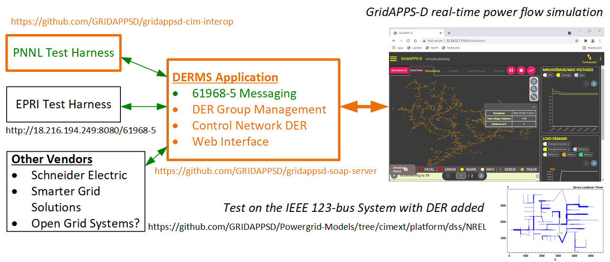

# DERMS Reference Application

The Distributed Energy Resource Management System (DERMS) Reference Application
provides minimum functionality for a DERMS. It can be used for demonstrations,
or the starting point for other DERMS implementations that run in GridAPPS-D.
As depicted below, key features of this DERMS Reference Application include:

- Support for IEC 61968-5:2020, "Application integration at electric utilities - System interfaces for distribution management - Part 5: Distributed energy optimization"
- Managing DER groups
- Allocating group dispatch commands from IEC 61968-5 to individual DER units, e.g., participation weighted by DER capacity
- Updated visual displays in a running GridAPPS-D simulation
- Reporting DER group outputs via IEC 61968-5 messages

GridAPPS-D also manages the connection of DER units to the network model in CIM.

### There are three parts of this repository:
- The circuit directory contains the scripts that will create the Transactive123 model that has DER units, which can be tested on.
- The gui directory that contains a web server using Flask, which can be used by an user to control the DERMS in the Transactive123 model by sending messages in the IEC 61968-5 format.
- The soap-server directory has a server setup using Spyne, which receives messages in IEC 61968-5 format and makes change in the Transactive123 model accordingly.

### Requirements
This application require GridApps-D to be installed and running.